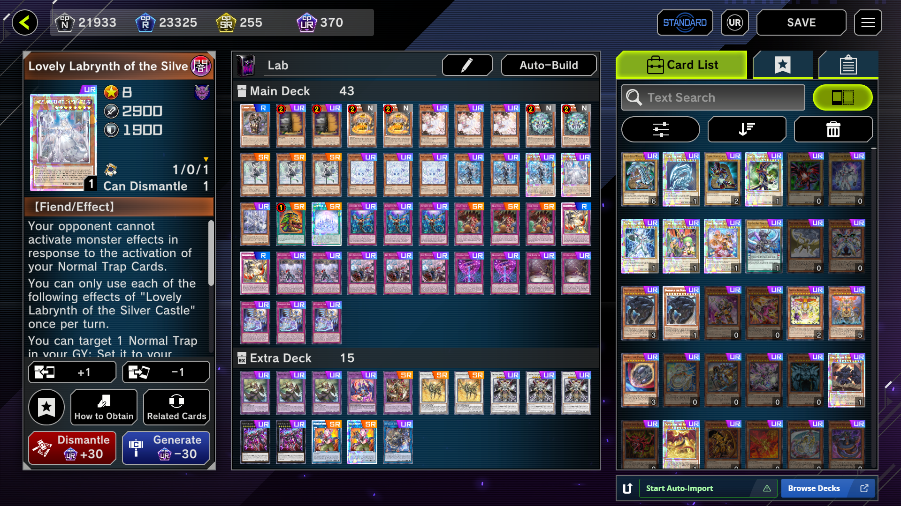

# MD to CSV #

This is a script that looks at a deck in Master Duel and creates a .csv describing it. 
I personally use it to manage decks in MS Excel.  
The script will control Your mouse and keyboard.  
The script will get the deck name.
Then it will look at the amount of cards in the Main and Extra Deck.  
Afterwards, the script looks at each card name, one by one, and counts how many of each card is in the deck.

This script can also make use of the Decorate YDK script: https://github.com/HannesHaglund/DecorateYDK  

It's used to get card names with over 31 letters. 
To use Decorate YDK with my script, just put my script and the the extracted **"DecorateYDK-main"** folder (The folder must be that exact name)
in the same folder.

## Notes
- Press **Enter** to stop the script.
- The script only works if Master Duel is fullscreen in your primary monitor.

## Prerequisites
1. Have Python 3 downloaded

## Installation
1. Download the zip in releases
1. Extract the folder wherever you want
1. Right click the extracted folder and select "open in terminal"
1. Run this command "pip install -r requirements.txt" 

## Usage
0. Have the deck opened like this:

1. Run the Python script "md_to_csv .py"

### With Decorate YDK
1. You will be asked to Update the database (Unless a file **"cardinfo.json"** is in the same location as the script). 
  cardinfo.json is used for spell checking and getting names longer than 31 characters.  
  Update only when new cards are relesed in Yu-Gi-Oh.
  
1. Press 1 to update the database. This triggers the Decorate YDK script and makes or updates cardinfo.json.  
	Press 0 to skip the update.
